# MEAN Web Stack Implementation on AWS
## Introduction

This project showcases the configuration, containerization, and management of a modern, multi-tier web application architecture designed for scalable and reliable cloud deployment.

---

### MongoDB
At the data tier, **MongoDB** serves as the NoSQL document database. It stores application data in flexible, JSON-like documents, allowing the schema to evolve dynamically without complex migrations, which ensures fast read and write operations for heavy data traffic.

### Express.js
Handling the server-side logic is **Express.js**, a minimal and flexible Node.js web application framework. It provides a robust set of features for building single-page, multi-page, and hybrid web applications, managing the API routing and handling HTTP requests from the frontend efficiently.

### Angular
The user interface is powered by **Angular**, a development platform and TypeScript-based framework for building scalable single-page web applications. It delivers a dynamic, responsive client-side experience by efficiently synchronizing data between the UI components and the backend APIs.

### Node.js
Serving as the foundation for the backend runtime environment is **Node.js**. Built on Chrome's V8 JavaScript engine, it uses an asynchronous, event-driven I/O model that allows the server to handle thousands of concurrent connections with minimal overhead.

---

## Deployment Architecture Overview

### Target Environment
* **Cloud Provider:** Amazon Web Services (AWS)
* **Compute Resource:** Elastic Compute Cloud (EC2) Instance
* **Operating System:** Ubuntu 26.04 LTS (HVM)
* **Default Region:** us-east-1
 

## Step 0: Prerequisites

1. EC2 Instance of t3.micro type and Ubuntu 26.04 LTS (HVM) was lunched in the us-east-1 region using the AWS console.

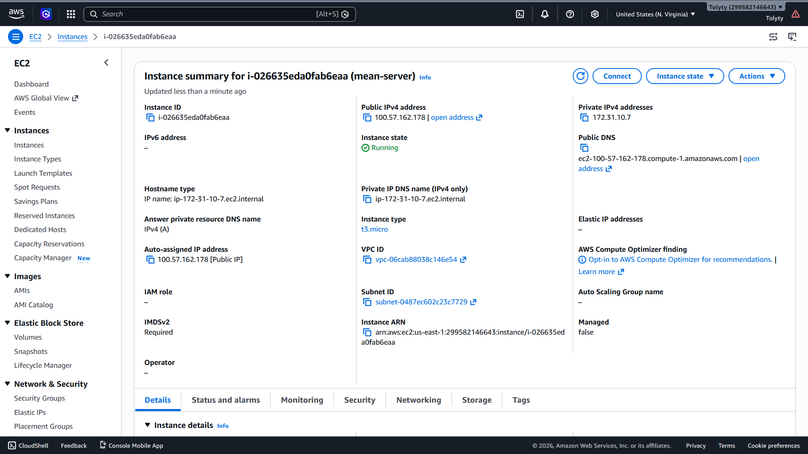

2. Attached SSH key named `mean-key` to access the instance on port 22

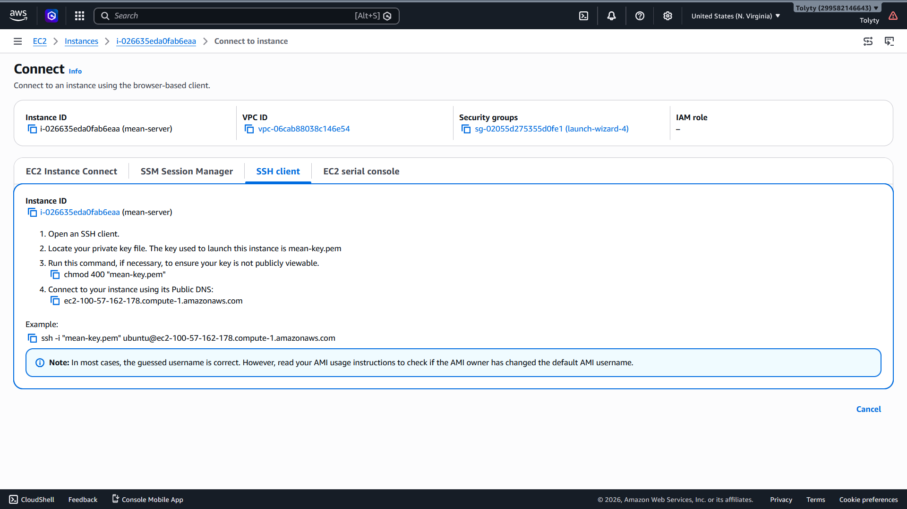

3. The security group was configured with the following inbound rules:
   - Allow traffic on port 80 (HTTP) with source from anywhere on the internet.
   - Allow traffic on port 443 (HTTPS) with source from anywhere on the internet.
   - Allow traffic on port 22 (SSH) with source from any IP address. This is opened by default.

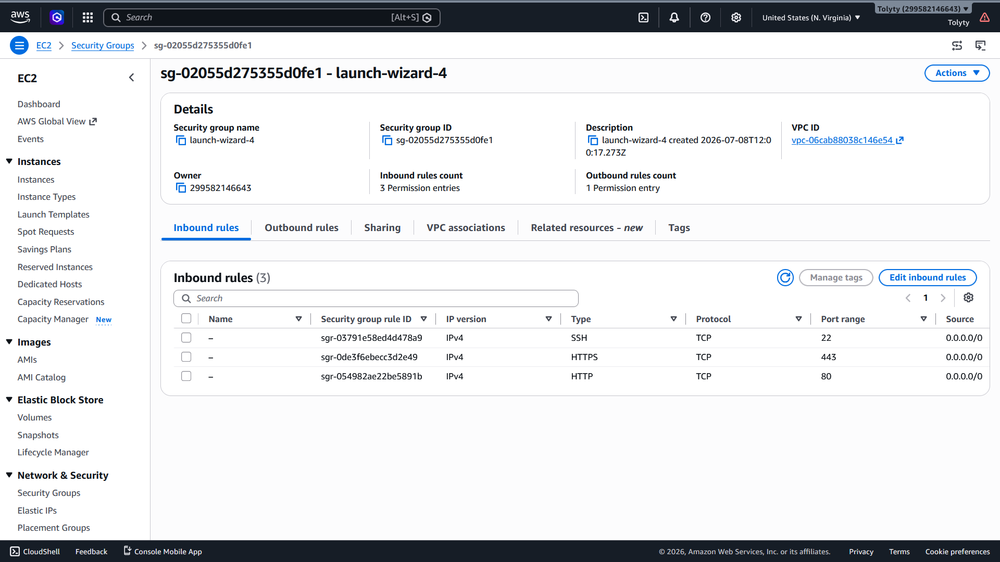

4. The private ssh key permission was changed for the private key file and then used to connect to the instance by running

```
chmod 400 mean-key.pem
```
```
ssh -i "key.pem" usernameu@ec2-public-ip-address.compute-1.amazonaws.com
```
Where `username=ubuntu` 

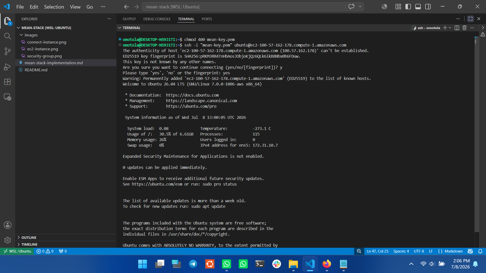

## Step 1 - Install Nodejs

Node.js is a JavaScript runtime built on Chrome's V8 JavaScript engine. Node.js is used in this tutorial to set up the Express routes and AngularJS controllers.

1. **Update and Upgrade ubuntu**

```
sudo apt update && sudo apt upgrade -y
```

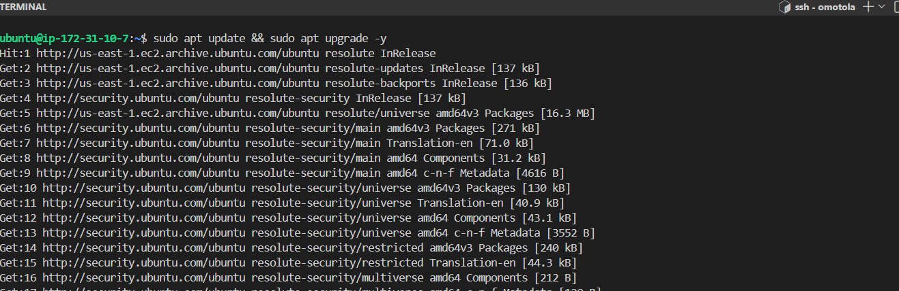
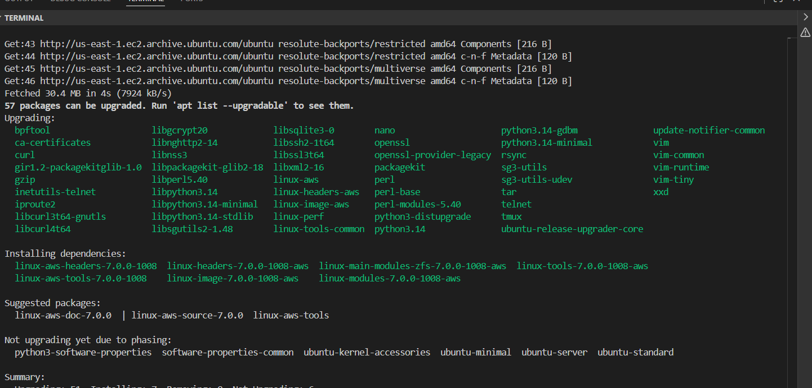
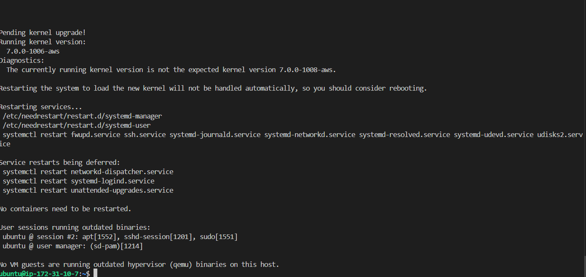

2. **Add certificates**

```
sudo apt -y install curl dirmngr apt-transport-https lsb-release ca-certificates
```

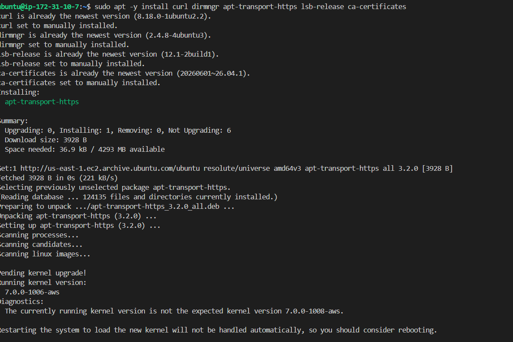

```
curl -sL https://deb.nodesource.com/setup_22.x | sudo -E bash -
```

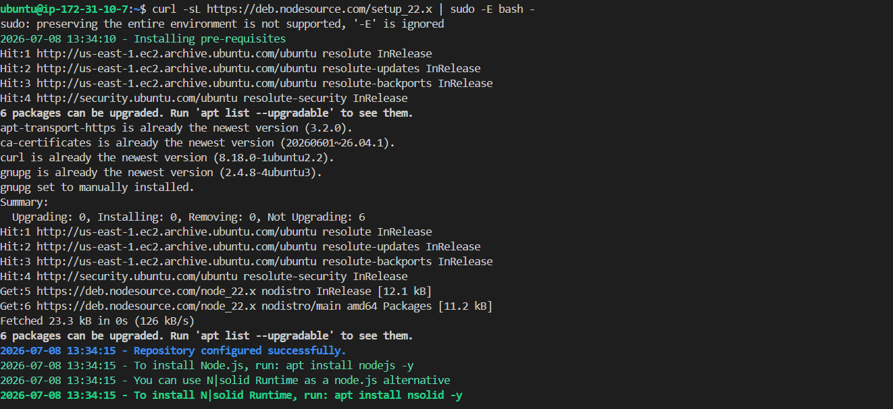

3. **Install NodeJS**

```
sudo apt install -y nodejs
```

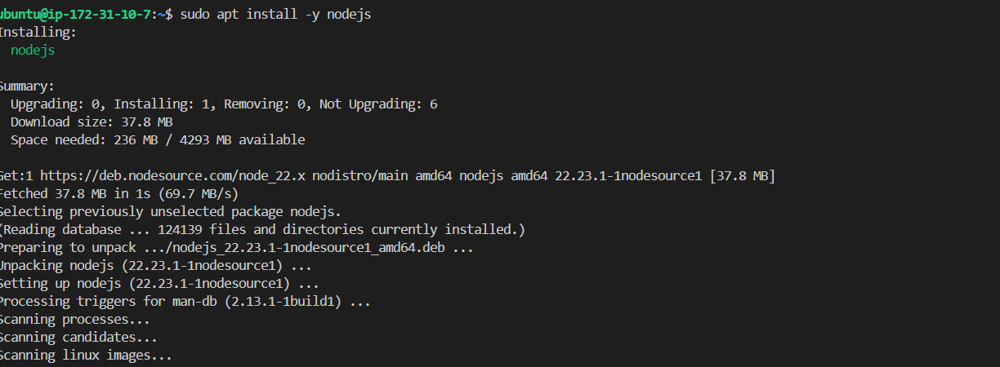

## Step 2 - Install MongoDB

For this application, Book records were added to MongoDB that contain book name, isbn number, author, and number of pages.

1. **Download the MongoDB public GPG key**

```
curl -fsSL https://www.mongodb.org/static/pgp/server-7.0.asc | sudo gpg -o /usr/share/keyrings/mongodb-server-7.0.gpg --dearmor
```

2. **Add the MongoDB repository**

```
echo "deb [ arch=amd64,arm64 signed-by=/usr/share/keyrings/mongodb-server-7.0.gpg ] \
https://repo.mongodb.org/apt/ubuntu jammy/mongodb-org/7.0 multiverse" | \
sudo tee /etc/apt/sources.list.d/mongodb-org-7.0.list
```

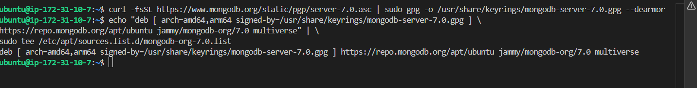

3. **Update the package database and install MongoDB**

```
sudo apt-get update
```

```
sudo apt-get install -y mongodb-org
```

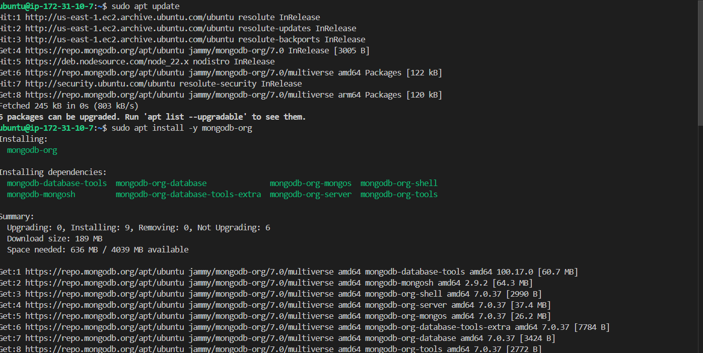

4. **Start and enable MongoDB**

```
sudo systemctl start mongod
sudo systemctl enable mongod
sudo systemctl status mongod
```

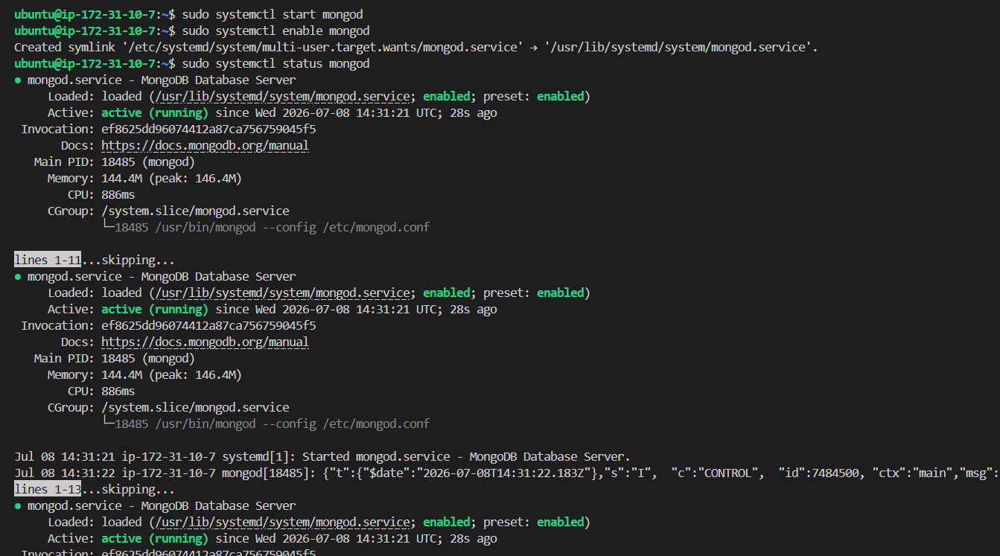

5. **Install body-parser package**

`body-parser` package is needed to help process JSON files passed in requests to the server.

```
sudo npm install body-parser
```

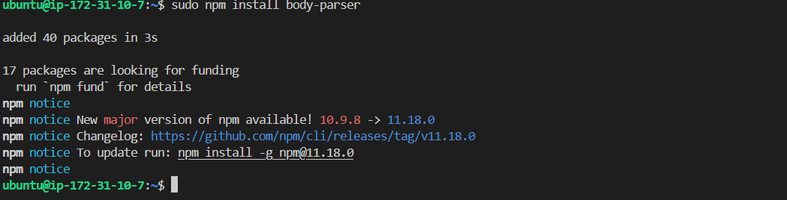

6. **Create the project root folder named `Books`**

```
mkdir Books && cd Books
```

Initialize the root folder

```
npm init
```

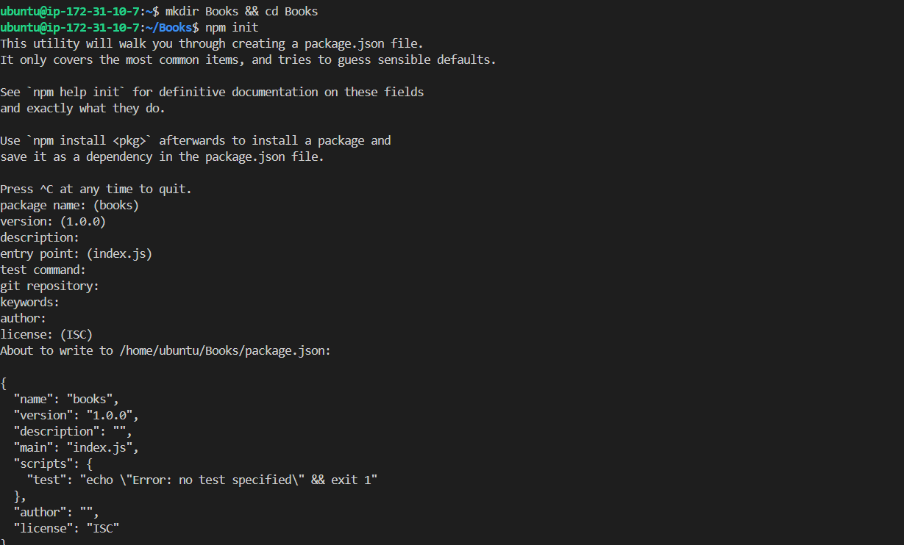

Add file named server.js to Books folder

```
vim server.js
```

Copy and paste the web server code below into the server.js file.

```javascript
const express = require('express');
const bodyParser = require('body-parser');
const mongoose = require('mongoose'); // Make sure mongoose is installed and required
const path = require('path'); // To handle static file serving
const MONGO_URI = 'mongodb://localhost:27017/books';
const app = express();

// Connect to MongoDB
mongoose.connect(MONGO_URI)
  .then(() => console.log('MongoDB connected'))
  .catch(err => console.error('MongoDB connection error:', err));

// Middleware
app.use(bodyParser.json());
app.use(express.static(path.join(__dirname, 'public')));

// Routes
require('./apps/routes')(app);

// Start the server
app.set('port', 3300);
app.listen(app.get('port'), () => {
  console.log('Server up: http://localhost:' + app.get('port'));
});
```


## Step 3 - Install Express and set up routes to the server

Express was used to pass book information to and from our MongoDB database. Mongoose package provides a straightforward schema-based solution to model the application data. Mongoose was used to establish a schema for the database to store data of the book register.

1. **Install express and mongoose**

```
sudo npm install express mongoose
```

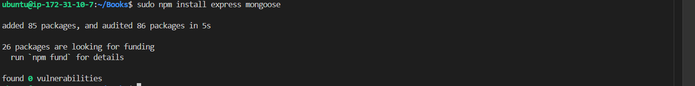

2. **In Books folder, create a folder named `apps`**

```
mkdir apps && cd apps
```

In apps, create a file named routes.js

```
vim routes.js
```

Copy and paste the code below into routes.js

```javascript
const Book = require('./models/book');
const path = require('path');

module.exports = function(app) {
  // Get all books
  app.get('/book', async (req, res) => {
    try {
      const books = await Book.find({});
      res.json(books);
    } catch (err) {
      console.error(err);
      res.status(500).json({ error: 'Internal Server Error' });
    }
  });

  // Add a new book
  app.post('/book', async (req, res) => {
    try {
      const book = new Book({
        name: req.body.name,
        isbn: req.body.isbn,
        author: req.body.author,
        pages: req.body.pages
      });
      const result = await book.save();
      res.json({
        message: "Successfully added book",
        book: result
      });
    } catch (err) {
      console.error(err);
      res.status(500).json({ error: 'Internal Server Error' });
    }
  });

  // Update a book
  app.put('/book/:isbn', async (req, res) => {
    try {
      const updatedBook = await Book.findOneAndUpdate(
        { isbn: req.params.isbn },
        req.body,
        { new: true }
      );
      if (!updatedBook) {
        return res.status(404).json({ error: 'Book not found' });
      }
      res.json({
        message: "Successfully updated the book",
        book: updatedBook
      });
    } catch (err) {
      console.error(err);
      res.status(500).json({ error: 'Internal Server Error' });
    }
  });

  // Delete a book
  app.delete('/book/:isbn', async (req, res) => {
    try {
      const result = await Book.findOneAndRemove({ isbn: req.params.isbn });
      if (!result) {
        return res.status(404).json({ error: 'Book not found' });
      }
      res.json({
        message: "Successfully deleted the book",
        book: result
      });
    } catch (err) {
      console.error(err);
      res.status(500).json({ error: 'Internal Server Error' });
    }
  });

  // Serve static files
  app.get('*', (req, res) => {
    res.sendFile(path.join(__dirname, '../public', 'index.html'));
  });
};
```

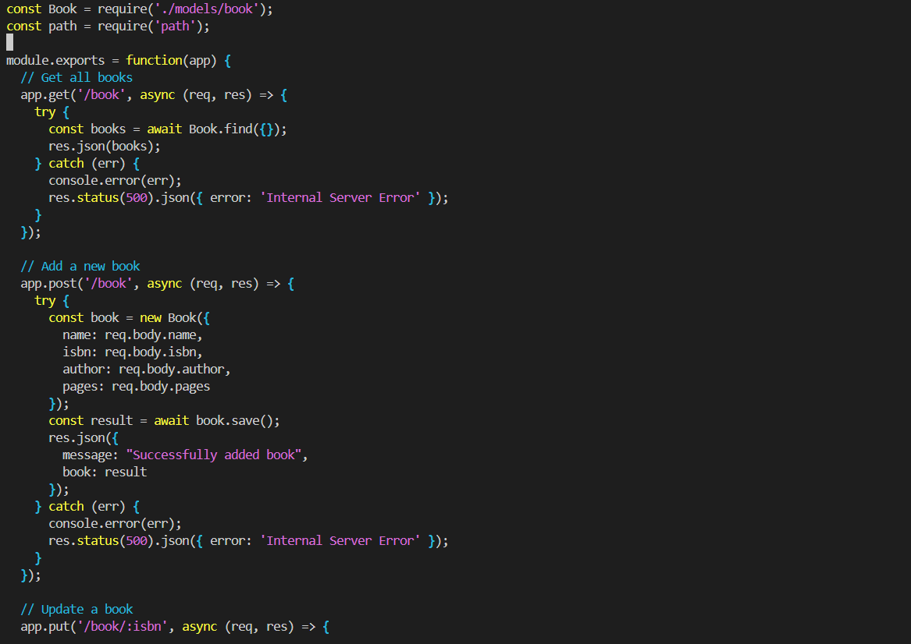

3. **In the `apps` folder, create a folder named models**

```
mkdir models && cd models
```

In models, create a file named book.js

```
vim book.js
```

Copy and paste the code below into book.js

```javascript
const mongoose = require('mongoose');

const bookSchema = new mongoose.Schema({
  name: { type: String, required: true },
  isbn: { type: String, required: true, unique: true },
  author: { type: String, required: true },
  pages: { type: Number, required: true }
});

module.exports = mongoose.model('Book', bookSchema);
```

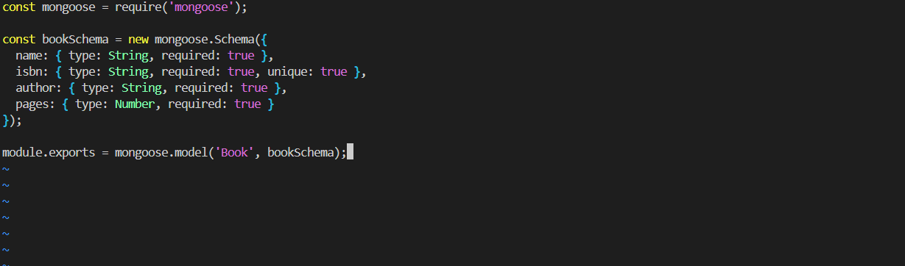


## Step 4 - Access the routes with AngularJS

In this project, AngularJS was used to connect the web page with Express and perform actions on the book register.

1. **Change the directory back to `Books` and create a folder named `public`**

```
cd ../..
```

```
mkdir public && cd public
```

Add a file named script.js into public folder

```
vim script.js
```

Copy and paste the code below (controller configuration defined) into the script.js file.

```javascript
var app = angular.module('myApp', []);

app.controller('myCtrl', function($scope, $http) {
  // Get all books
  function getAllBooks() {
    $http({
      method: 'GET',
      url: '/book'
    }).then(function successCallback(response) {
      $scope.books = response.data;
    }, function errorCallback(response) {
      console.log('Error: ' + response.data);
    });
  }

  // Initial load of books
  getAllBooks();

  // Add a new book
  $scope.add_book = function() {
    var body = {
      name: $scope.Name,
      isbn: $scope.Isbn,
      author: $scope.Author,
      pages: $scope.Pages
    };
    $http({
      method: 'POST',
      url: '/book',
      data: body
    }).then(function successCallback(response) {
      console.log(response.data);
      getAllBooks();  // Refresh the book list
      // Clear the input fields
      $scope.Name = '';
      $scope.Isbn = '';
      $scope.Author = '';
      $scope.Pages = '';
    }, function errorCallback(response) {
      console.log('Error: ' + response.data);
    });
  };

  // Update a book
  $scope.update_book = function(book) {
    var body = {
      name: book.name,
      isbn: book.isbn,
      author: book.author,
      pages: book.pages
    };
    $http({
      method: 'PUT',
      url: '/book/' + book.isbn,
      data: body
    }).then(function successCallback(response) {
      console.log(response.data);
      getAllBooks();  // Refresh the book list
    }, function errorCallback(response) {
      console.log('Error: ' + response.data);
    });
  };

  // Delete a book
  $scope.delete_book = function(isbn) {
    $http({
      method: 'DELETE',
      url: '/book/' + isbn
    }).then(function successCallback(response) {
      console.log(response.data);
      getAllBooks();  // Refresh the book list
    }, function errorCallback(response) {
      console.log('Error: ' + response.data);
    });
  };
});
```

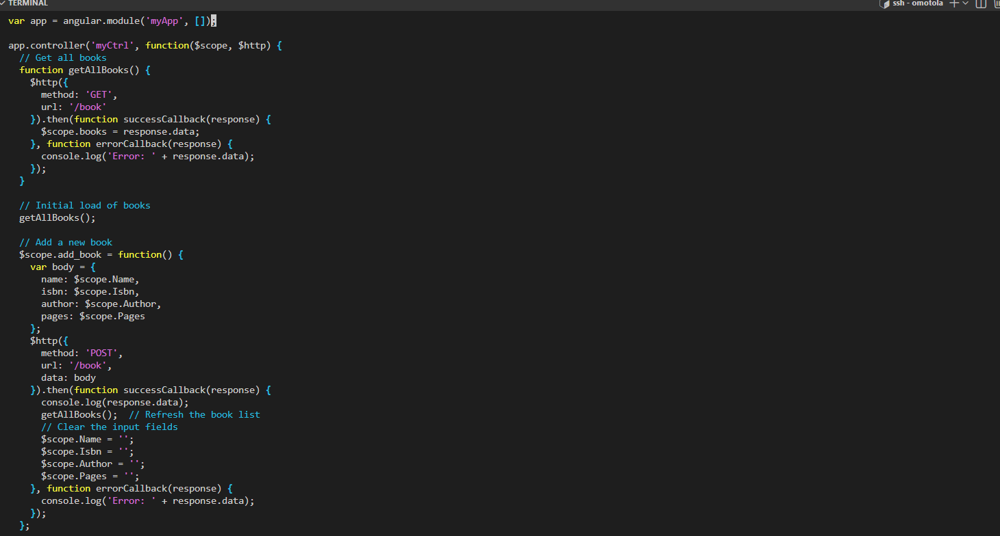
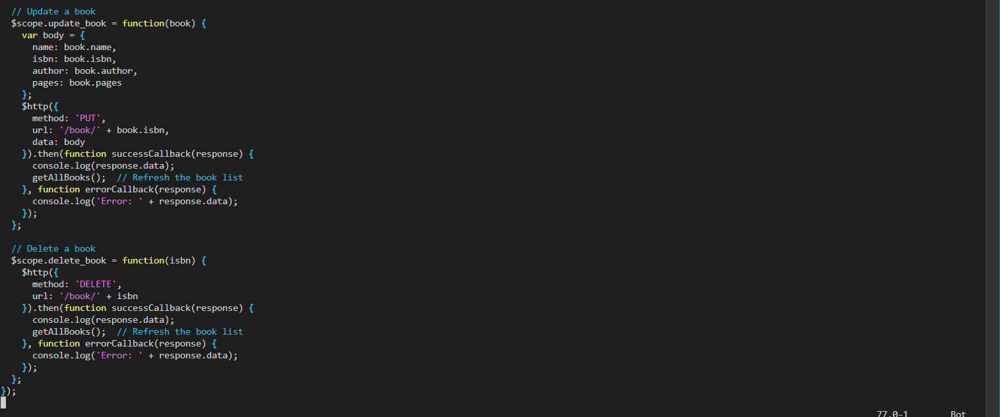


2. **In `public` folder, create a file named index.html**

```
vim index.html
```

Copy and paste the code below into index.html file

```html
<!DOCTYPE html>
<html ng-app="myApp" ng-controller="myCtrl">
<head>
  <script src="https://ajax.googleapis.com/ajax/libs/angularjs/1.6.4/angular.min.js"></script>
  <script src="script.js"></script>
  <style>
    /* Add your custom CSS styles here */
  </style>
</head>
<body>
  <div>
    <table>
      <tr>
        <td>Name:</td>
        <td><input type="text" ng-model="Name"></td>
      </tr>
      <tr>
        <td>Isbn:</td>
        <td><input type="text" ng-model="Isbn"></td>
      </tr>
      <tr>
        <td>Author:</td>
        <td><input type="text" ng-model="Author"></td>
      </tr>
      <tr>
        <td>Pages:</td>
        <td><input type="number" ng-model="Pages"></td>
      </tr>
    </table>
    <button ng-click="add_book()">Add</button>
    <div ng-if="successMessage">{{ successMessage }}</div>
    <div ng-if="errorMessage">{{ errorMessage }}</div>
  </div>
  <hr>
  <div>
    <table>
      <tr>
        <th>Name</th>
        <th>Isbn</th>
        <th>Author</th>
        <th>Page</th>
        <th>Action</th>
      </tr>
      <tr ng-repeat="book in books">
        <td>{{ book.name }}</td>
        <td>{{ book.isbn }}</td>
        <td>{{ book.author }}</td>
        <td>{{ book.pages }}</td>
        <td><button ng-click="del_book(book)">Delete</button></td>
      </tr>
    </table>
  </div>
</body>
</html>
```

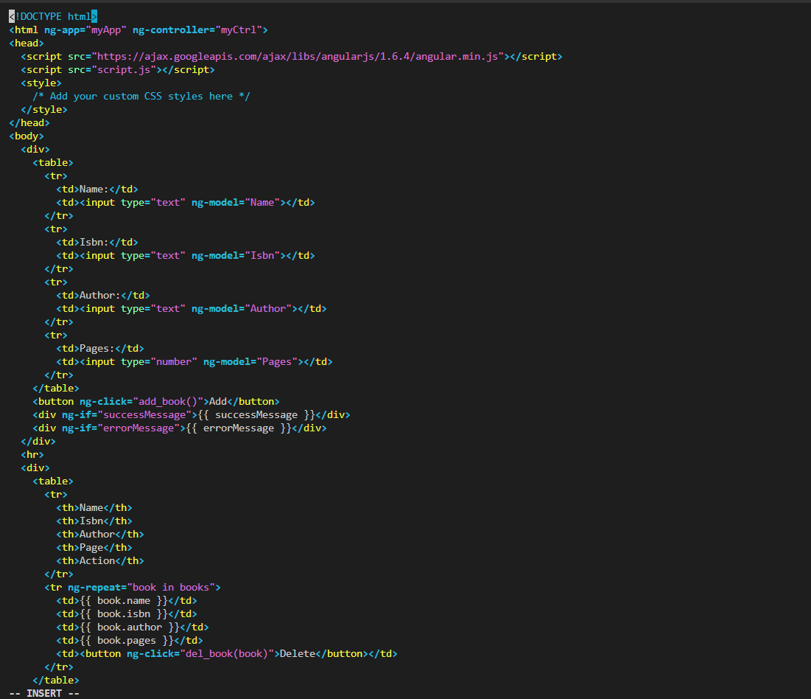

3. **Change the directory back up to `Books` and start the server**

```
cd ..
node server.js
```

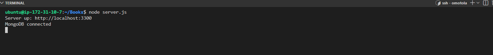

The server is now up and running, Connection to it is via port 3300. A separate Putty or SSH console to test what curl command returns locally can be launched.

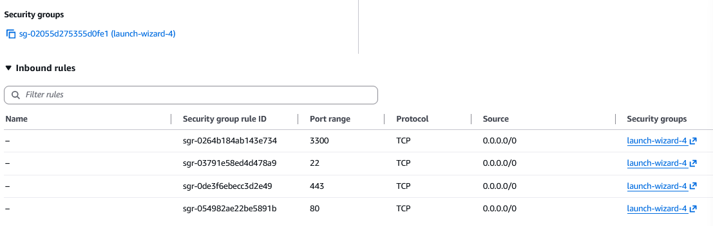

The Book Register web application can now be accessed from the internet with a browser using the Public IP address or Public DNS name.

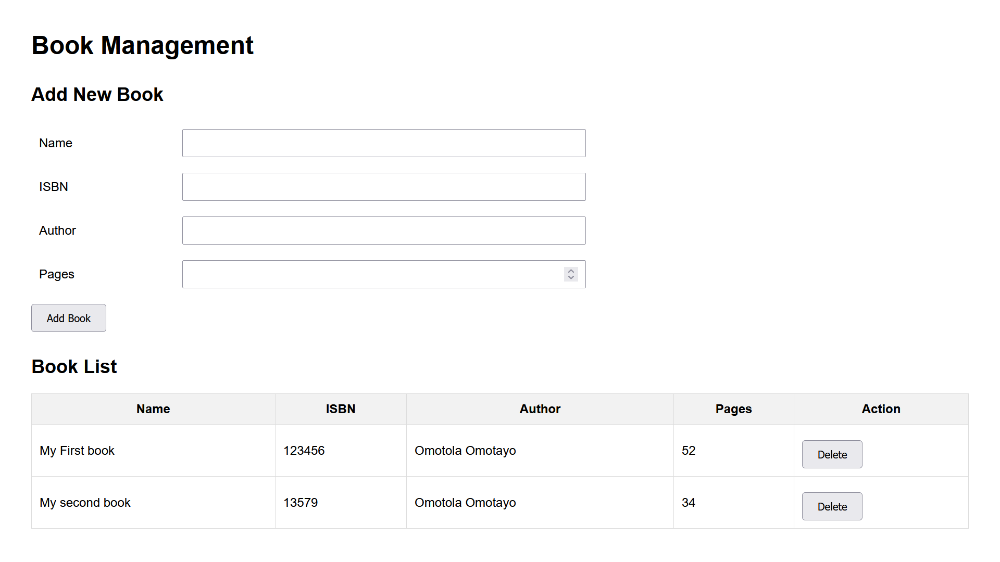

## Conclusion

The MEAN stack, consisting of MongoDB, Express.js, Angular, and Node.js, offers a comprehensive and efficient framework for developing modern web applications. Each technology plays a distinct role, working together to deliver a seamless full-stack development experience.

By leveraging JavaScript across both the client and server sides, the MEAN stack simplifies the development process, improves code consistency, and enhances collaboration among development teams. Its scalability, flexibility, and extensive open-source ecosystem make it an excellent choice for building dynamic, high-performance, and maintainable web applications that can adapt to evolving business and user requirements.